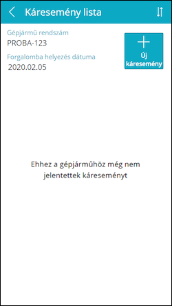
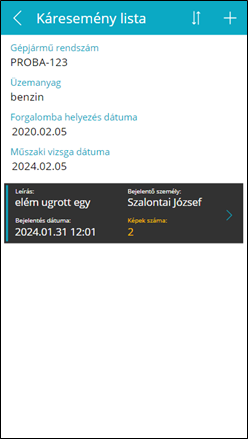
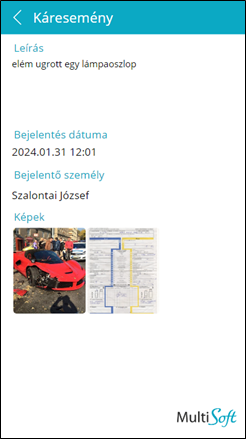

# Káresemények

Az Káresemény lista oldal hasonló az Óraállás listához, ezen is láthatóak a gépjármű főbb adatai valamint a korábban felvett káresemények:
-	Üres lista esetén az *„Ehhez a gépjárműhöz még nem jelentettek káreseményt”* felirat jelenik meg
-	A lista görgethető ha már nem férnek ki a képernyőre a káresemények
-	Egy listaelemre koppintva az adott káresemény részletei jelennek meg egy újabb lapon

Új káreseményt felvételére az **Új káresemény** gombra kattintva nyílik lehetőség:

A **toolbar**on a következő elemek láthatóak (balról jobbra haladva):

-	Vissza a [Kezdőoldal](../login/05_StartPage.md)ra
-	(Cím)
-	Rendezés káresemény dátuma szerint növekvő/csökkenő sorrendben
