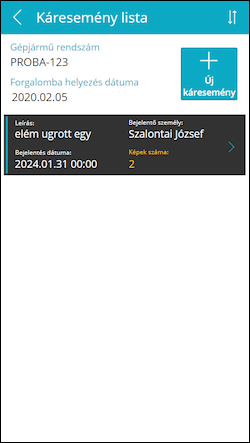

# Beállítások

Az Káresemény lista oldal nagyon hasonló az Óraállás listához, ezen is a gépjármű főbb adatai láthatóak valamint a korábban felvett káresemények:
-	Üres lista esetén az „Ehhez a gépjárműhöz még nem jelentettek káreseményt” felirat jelenik meg
-	A lista görgethető ha már nem férnek ki a képernyőre a káresemények
-	Egy listaelemre koppintva az adott káresemény részletei jelennek meg egy újabb lapon

A **toolbar**on a következő elemek láthatóak (balról jobbra haladva):

-	Vissza a belépőoldalra
-	(Cím)
-	Rendezés káresemény dátuma szerint növekvő/csökkenő sorrendben
-	Új káresemény felvétele
