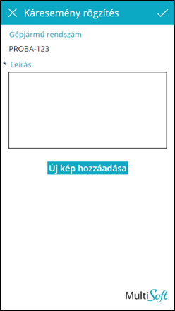
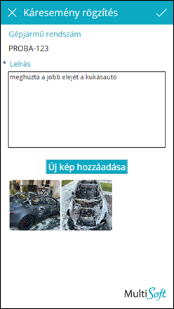

# Új káresemény

Új káresemény rögzítésénél kötelező megadni a következőket:
-	Baleset rövid **leírás**a
-	**Fényképek**: balesetről készült fotók és a baleseti bejelentő (kék-sárga) dokumentum fotója

Az *Új kép hozzáadása* gombra koppintva lehet egyenként (sajnos, PowerApp limitáció) kiválasztani a fotókat.

Rögzíteni a **toolbar** jobb oldalán lévő pipa gombbal kell. Ha a rögzítés sikeres, az applikáció visszanavigál az [Káresemény lista](./chapters/accidents/05_AccidentsList.md) oldalra.

Ha a rögzítés során hiba történik, a hibaüzenet a lap alján jelenik meg, piros szöveggel.
