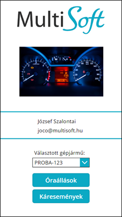

# Kezdőlap

Amikor betölt az applikáció, a következő kezdő képernyő látható:

A *Választott gépjármű* felirat alatt, a lenyiló listában az adott felhasználóhoz rendelt összes gépjármű rendszáma látható. Ez az esetek 99%-ában 1 db járművet jelent és ez rögtön ki is van választva. 

A gombokkal a következő funkciók érhetők el:
-   **+ Új óraállás**: rögtön az óraállás bejelentő oldalra navigál
-	**Óraállás lista**: az adott gépjárműhöz már korábban rögzített km-óraállásokat mutatja
-	**Káresemények**: az adott gépjárműhöz már korábban rögzített káreseményeket mutatja
