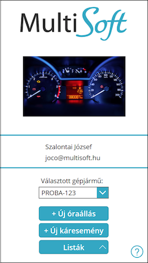

# Kezdőlap

Amikor betölt az applikáció, a következő kezdő képernyő látható:

A gépjárművek listájában az összes hozzátok rendelt gépjármű rendszáma látható, ez az esetek 99%-ában 1 db járművet jelent és ez rögtön ki is van választva. Innen 2 listát lehet lekérni:
-	Óraállások: az adott gépjárműhöz már korábban rögzített km-óraállások
-	Káresemények: az adott gépjárműhöz már korábban rögzített káresemények
