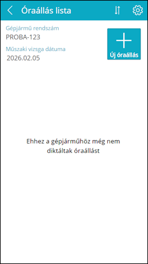
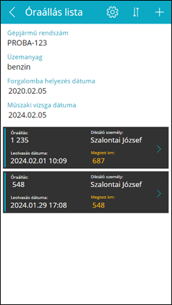
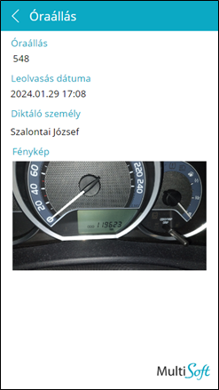

# Óraállások

Az **Óraállás lista** oldalon a gépjármű főbb adatai láthatóak valamint a korábban diktált km-óraállások:
-	Üres lista esetén az „*Ehhez a gépjárműhöz még nem diktáltak óraállást*” felirat jelenik meg
-	A lista görgethető ha már nem férnek ki a képernyőre az óraállások
-	Egy listaelemre koppintva az adott óraállás részletei jelennek meg egy újabb lapon

A **toolbar**on a következő elemek láthatóak (balról jobbra haladva):

-	Vissza a belépőoldalra
-	(Cím)
-	Beállítások
-	Rendezés leolvasás dátuma szerint növekvő/csökkenő sorrendben
-	Új óraállás felvétele

**Fontos**: navigálni az oldalak között az androidos *Back* gombbal/mozdulattal **nem** lehet. Ehhez a **toolbar** bal oldalán található *Vissza* gombot kell használni. Az androidos *Back* funkció az applikácóból való kilépésre szolgál.