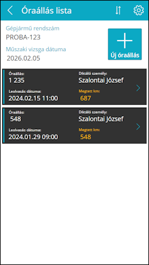

# Óraállások

Az **Óraállás lista** oldalon a gépjármű főbb adatai láthatóak valamint a korábban diktált km-óraállások:
-	Üres lista esetén az *„Ehhez a gépjárműhöz még nem diktáltak óraállást”* felirat jelenik meg
-	A lista görgethető ha már nem férnek ki a képernyőre az óraállások
-	Egy listaelemre koppintva az adott óraállás részletei jelennek meg egy újabb lapon

A **toolbar**on a következő elemek láthatóak (balról jobbra haladva):

-	Vissza a [Kezdőoldal](../login/05_StartPage.md)ra
-	(Cím)
-	[Beállítások](20_ReminderSettings.md)
-	Rendezés leolvasás dátuma szerint növekvő/csökkenő sorrendben
-	[Új óraállás](15_NewMileageRecord.md) felvétele
