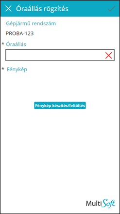

# Új óraállás

Új óraállás rögzítésénél kötelező megadni a következőket:
-	Aktuális **óraállás**
-	**Fénykép** a km-óráról (Odometer)

A diktált óraállás értéke nagyobb kell hogy legyen mint az utoljára rögzített óraállás. Amíg ez nem teljesül, addig egy piros X látható az óraállás textbox jobb oldalán és nem lehet végrehajtani a rögzítést.

A fénykép hitelesítési célt szolgál. A elkészített fényképen jól látható kell hogy legyen a km-óraállás. A *Fénykép készítés/feltöltés* gombra koppintva a következő történik:
-	Android app: megnyílik a kamera alkalmazás a fénykép készítéséhez
-	Desktop app: meglévő fotót lehet tallózni és feltölteni

Rögzíteni a **toolbar** jobb oldalán lévő pipa gombbal kell. Ha a rögzítés sikeres, az applikáció visszanavigál az **Óraállás lista** oldalra.

Ha a rögzítés során hiba történik, a hibaüzenet a lap alján jelenik meg, piros szöveggel.
