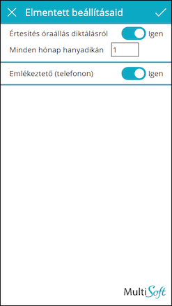

# Beállítások

A beállítások oldalon a következő opciók találhatóak:
-	Diktálási értesítő (email) ki-bekapcsolása
-	A hónap hanyadik napján jöjjön email értesítés

A diktálási értesítő email az adott felhasználó email címére érkezik minden hónap azon napján amelyet a felhasználó beállít. Az alapértelmezett beállítás minden hónap 1. napja.