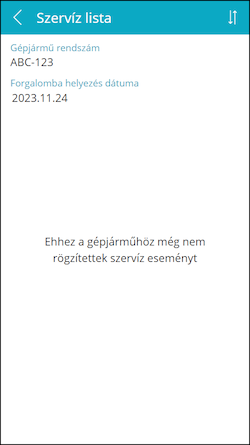
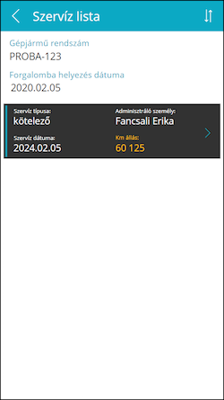

# Szervízek

A **Szervíz lista** oldal hasonló az Óraállás listához, ezen is láthatóak a gépjármű főbb adatai valamint a gépjárművön elvégzett szervízek:
-	Üres lista esetén az *„Ehhez a gépjárműhöz még rögzítettek szervíz eseményt”* felirat jelenik meg
-	A lista görgethető ha már nem férnek ki a képernyőre a szervíz események
-	Egy listaelemre koppintva az adott szervíz részletei jelennek meg egy újabb lapon

A **toolbar**on a következő elemek láthatóak (balról jobbra haladva):

-	Vissza a [Kezdőoldal](../login/05_StartPage.md)ra
-	(Cím)
-	Rendezés szervíz dátuma szerint növekvő/csökkenő sorrendben
